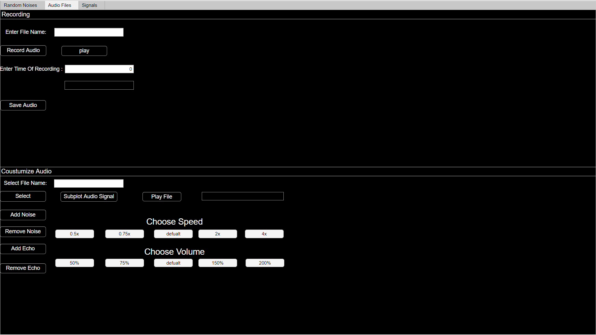
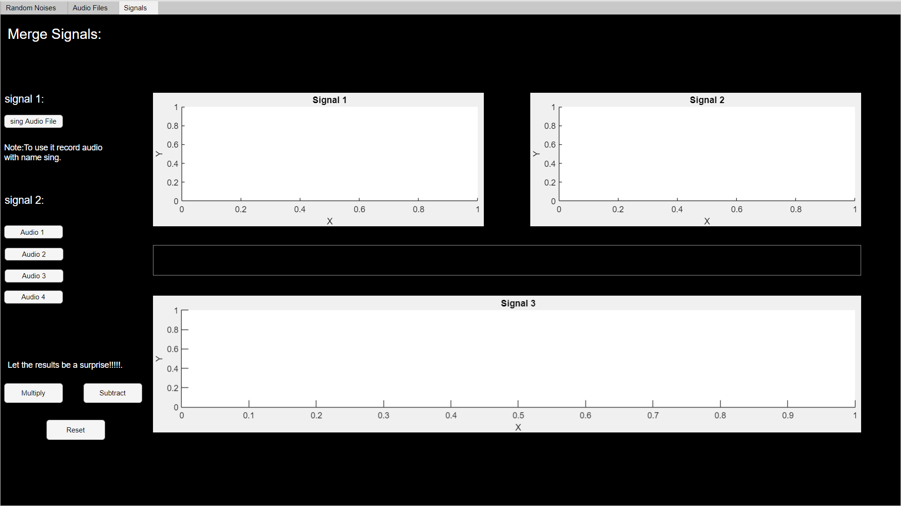

# matlab-Audio-Signal-Processing-APP
Matlab app for simple audio signal processing

## 🚀 Features
-play some random audios
-record an audio 
-customize an audio
-third tap has a surprsie just try to play with it 

## 📸 Screenshots

## NOTE
-This is a just a basic app for signals processing with simple function.

-Before you use the third tap 
just download an audio files for your favourite songs 
and add the files to the project folder 
and the path in the source code(you will see a comment where to add the path) 
